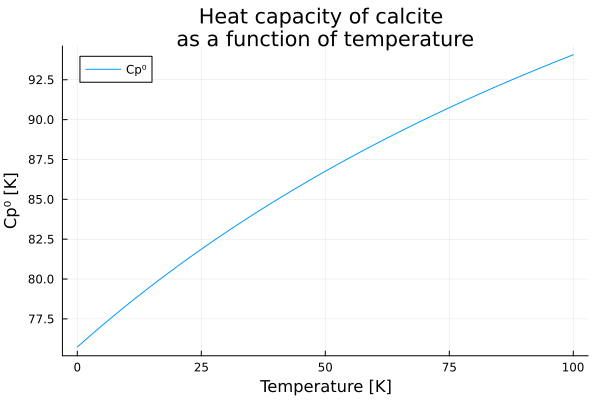

<p>
  
</p>

# ChemistryLab

[](https://jfbarthelemy.github.io/ChemistryLab.jl/dev/)
[](https://jfbarthelemy.github.io/ChemistryLab.jl/stable/)
[](https://github.com/jfbarthelemy/ChemistryLab.jl/actions/workflows/CI.yml?query=branch%3Amain)

[](https://doi.org/10.5281/zenodo.17756074)

ChemistryLab.jl is a computational chemistry toolkit. Although initially dedicated to low-carbon cementitious materials and aqueous solutions and designed for researchers, engineers, and developers working with cement chemistry, its scope is actually wider. It provides formula handling, species management, stoichiometric matrix construction, and database interoperability (ThermoFun and Cemdata). Main features include chemical formula parsing, Unicode/Phreeqc notation conversion, reaction and equilibrium analysis, and data import/export.

## Features

- **Chemical formula handling**: Create, convert, and display formulas with charge management and Unicode/Phreeqc notation.
- **Chemical species management**: `Species` and `CemSpecies` types to represent solution and solid phase species.
- **Stoichiometric matrices**: Automatic construction of matrices for reaction and equilibrium analysis.
- **Database interoperability**: Import and merge ThermoFun (.json) and Cemdata (.dat) data.
- **Parsing tools**: Convert chemical notations, extract charges, calculate molar mass, and more.

## Example

Let's imagine we want to study the equilibrium of calcite in water.

$CaCO_3 \rightleftharpoons Ca^{2+} + {CO_3}^{2-}$

To do this, we can create a list of chemical species, retrieve the thermodynamic properties of these species from one of the databases integrated into ChemistryLab. We can then deduce the chemical species likely to appear in the reaction and calculate the associated stoichiometric matrix.

In this example, the database is [cemdata](https://www.empa.ch/web/s308/thermodynamic-data). The `.json` file is included in ChemistryLab but is a copy of a file which can be found in [ThermoHub]("https://github.com/thermohub").

```@example readme
using ChemistryLab

filebasename = "cemdata18-thermofun.json"
df_elements, df_substances, df_reactions = read_thermofun_database("data/" * filebasename)
```

The chemical species likely to appear during calcite equilibrium in water are obtained in the following way:

```@example readme
df_calcite = get_compatible_species(split("Cal H2O@ CO2"), df_substances;
                        aggregate_states=[AS_AQUEOUS], exclude_species=split("H2@ O2@ CH4@"), union=true)
dict_species_calcite = build_species_from_database(df_calcite)
```

During species creation, ChemistryLab calculates the molar mass of the species. It also constructs thermodynamic functions (heat capacity, entropy, enthalpy, and Gibbs free energy of formation) as a function of temperature. The evolution of thermodynamic properties as a function of temperature, such as heat capacity, can thus be easily plotted.

```@example readme
dict_species_calcite["Cal"]
```

```@example readme
using Plots

p1 = plot(xlabel="Temperature [K]", ylabel="Cp⁰ [K]", title="Heat capacity of calcite as a function of temperature")
plot!(p1, θ -> dict_species_calcite["Cal"].Cp⁰(T = 273.15+θ), 0:0.1:100, label="Cp⁰")

savefig("heat_capacity_calcite.png"); nothing # hide
```




Obtaining stoichiometric matrices requires the choice of a species-independent basis.

```@example readme
primaries = [dict_species_calcite[s] for s in split("H2O@ H+ CO3-2 Ca+2")]
SM = StoichMatrix(values(dict_species_calcite), primaries); pprint(SM)
```

These stoichiometric matrices thus allow us to write the chemical reactions at work.

```@example readme
list_reactions = reactions(SM) ; pprint(list_reactions)
for r in list_reactions display(r); println() end
dict_reactions_calcite = Dict(r.symbol => r for r in list_reactions)
```

Again, when constructing the reactions, the thermodynamic properties of the reactions as a function of temperature are deduced. It is thus possible to see, for example, the expression for the solubility product of calcite for the reaction under study and to plot its evolution.

```@example readme
dict_reactions_calcite["Cal"].logK⁰
```

```@example readme
p1 = plot(xlabel="Temperature [K]", ylabel="pKs", title="Solubility product (pKs) of calcite as a function of temperature")
plot!(p1, θ -> dict_reactions_calcite["Cal"].logK⁰(T = 273.15+θ), 0:0.1:100, label="ln(K)")

savefig("solubility_product_calcite.png"); nothing # hide
```


## Installation

The package can be installed with the Julia package manager.
From the Julia REPL, type `]` to enter the Pkg REPL mode and run:

```julia
pkg> add ChemistryLab
```

Or, equivalently, via the `Pkg` API:

```julia
julia> import Pkg; Pkg.add("ChemistryLab")
```

## Usage

See the [documentation and tutorials](https://jfbarthelemy.github.io/ChemistryLab.jl) for examples on formula creation, species management, reaction parsing, and database merging.

## License

MIT License. See [LICENSE](LICENSE) for details.

## Citation

[](https://doi.org/10.5281/zenodo.17756074)

See [CITATION.cff](CITATION.cff) for citation details.

**BibTeX entry:**

```bibtex
@software{chemistrylab_jl,
  authors = {Barthélemy, Jean-François and Soive, Anthony},
  title = {ChemistryLab.jl: Numerical laboratory for computational chemistry},
  doi = {10.5281/zenodo.17756074},
  url = {https://github.com/jfbarthelemy/ChemistryLab.jl}
}
```

## Credits and Acknowledgements

Developed by [Jean-François Barthélémy](https://github.com/jfbarthelemy) and [Anthony Soive](https://github.com/anthonysoive), both researchers at [Cerema](https://www.cerema.fr/en) in the research team [UMR MCD](https://mcd.univ-gustave-eiffel.fr/).
