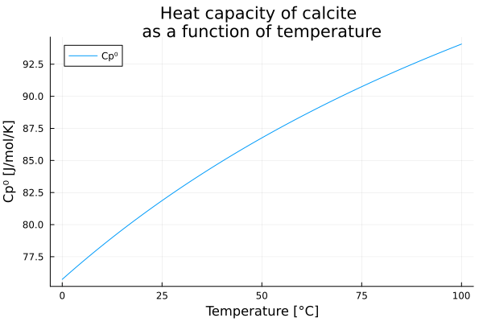
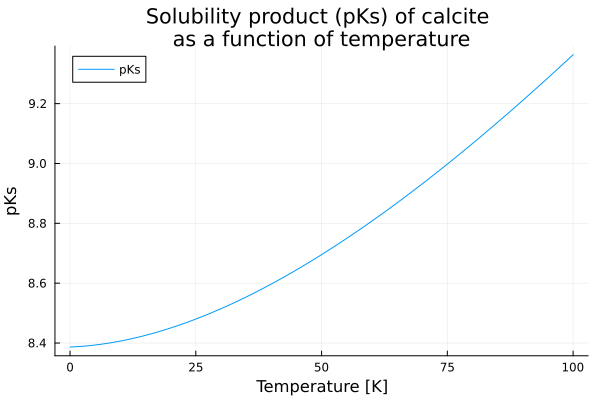

<p>
  
</p>

# ChemistryLab

[](https://github.com/jfbarthelemy/ChemistryLab.jl/actions/workflows/CI.yml?query=branch%3Amain)

[](https://jfbarthelemy.github.io/ChemistryLab.jl/dev/)
[](https://jfbarthelemy.github.io/ChemistryLab.jl/stable/)

[](https://github.com/fredrikekre/Runic.jl)

[](https://doi.org/10.5281/zenodo.17756074)


ChemistryLab.jl is a computational chemistry toolkit. Although initially dedicated to low-carbon cementitious materials and aqueous solutions and designed for researchers, engineers, and developers working with cement chemistry, its scope is actually wider. It provides formula handling, species management, stoichiometric matrix construction, and database interoperability (ThermoFun and Cemdata). Main features include chemical formula parsing, Unicode/Phreeqc notation conversion, reaction and equilibrium analysis, and data import/export.

## Features

- **Chemical formula handling**: Create, convert, and display formulas with charge management and Unicode/Phreeqc notation.
- **Chemical species management**: `Species` and `CemSpecies` types to represent solution and solid phase species.
- **Stoichiometric matrices**: Automatic construction of matrices for reaction and equilibrium analysis.
- **Database interoperability**: Import and merge ThermoFun (.json) and Cemdata (.dat) data.
- **Parsing tools**: Convert chemical notations, extract charges, calculate molar mass, and more.

## Installation

The package can be installed with the Julia package manager.
From the Julia REPL, type `]` to enter the Pkg REPL mode and run:

```julia
pkg> add ChemistryLab
```

Or, equivalently, via the `Pkg` API:

```julia
julia> import Pkg; Pkg.add("ChemistryLab")
```

## Example

Let's imagine we want to study the equilibrium of calcite in water.

$\text{CaCO}_3 \rightleftharpoons \text{Ca}^{2+} + {\text{CO}_3}^{2-}$

To do this, we can create a list of chemical species, retrieve the thermodynamic properties of these species from one of the databases integrated into ChemistryLab. We can then deduce the chemical species likely to appear in the reaction and calculate the associated stoichiometric matrix.

In this example, the database is [cemdata](https://www.empa.ch/web/s308/thermodynamic-data). The `.json` file is included in ChemistryLab but is a copy of a file which can be found in [ThermoHub]("https://github.com/thermohub").

```julia
using ChemistryLab

all_species = build_species("data/cemdata18-thermofun.json")
```

The chemical species likely to appear during calcite equilibrium in water are obtained in the following way:

```julia
species_calcite = speciation(all_species, split("Cal H2O@ CO2");
                             aggregate_state=[AS_AQUEOUS],
                             exclude_species=split("H2@ O2@ CH4@"))
dict_species_calcite = Dict(symbol(s) => s for s in species_calcite)
```

The output of `dict_species_calcite` reads:
```
Dict{String, Species} with 12 entries:
  "H+"        => H+ {H+} [H+ ◆ H⁺]
  "OH-"       => OH- {OH-} [OH- ◆ OH⁻]
  "CO2"       => CO2 {CO2  g} [CO2 ◆ CO₂]
  "Ca(HCO3)+" => Ca(HCO3)+ {CaHCO3+} [Ca(HCO3)+ ◆ Ca(HCO₃)⁺]
  "Cal"       => Cal {Calcite} [CaCO3 ◆ CaCO₃]
  "CaOH+"     => CaOH+ {CaOH+} [Ca(OH)+ ◆ Ca(OH)⁺]
  "H2O@"      => H2O@ {H2O  l} [H2O@ ◆ H₂O@]
  "Ca+2"      => Ca+2 {Ca+2} [Ca+2 ◆ Ca²⁺]
  "CO2@"      => CO2@ {CO2  aq} [CO2@ ◆ CO₂@]
  "HCO3-"     => HCO3- {HCO3-} [HCO3- ◆ HCO₃⁻]
  "CO3-2"     => CO3-2 {CO3-2} [CO3-2 ◆ CO₃²⁻]
  "Ca(CO3)@"  => Ca(CO3)@ {CaCO3  aq} [CaCO3@ ◆ CaCO₃@]
```

During species creation, ChemistryLab calculates the molar mass of the species. It also constructs thermodynamic functions (heat capacity, entropy, enthalpy, and Gibbs free energy of formation) as a function of temperature.

```julia
dict_species_calcite["Cal"]
```

```
Species{Int64}
           name: Calcite
         symbol: Cal
        formula: CaCO3 ◆ CaCO₃
          atoms: Ca => 1, C => 1, O => 3
         charge: 0
aggregate_state: AS_CRYSTAL
          class: SC_COMPONENT
     properties: M = 0.10008599996541243 kg mol⁻¹
                 Tref = 298.15 K
                 Pref = 100000.0 m⁻¹ kg s⁻²
                 Cp⁰ = 104.5163192749 + 0.02192415855825T + -2.59408e6 / (T^2) [m² kg s⁻² K⁻¹ mol⁻¹] ◆ T=298.15 K
                 ΔₐH⁰ = -1.2482415842895252e6 + 104.5163192749T + 2.59408e6 / T + 0.010962079279125(T^2) [m² kg s⁻² mol⁻¹] ◆ T=298.15 K    
                 S⁰ = -523.9438829693111 + 0.02192415855825T + 104.5163192749log(T) + 1.29704e6 / (T^2) [m² kg s⁻² K⁻¹ mol⁻¹] ◆ T=298.15 K 
                 ΔₐG⁰ = -1.1423813547027335e6 + 628.460202244211T + 1.29704e6 / T - 0.010962079279125(T^2) - 104.5163192749T*log(T) [m² kg s⁻² mol⁻¹] ◆ T=298.15 K
                 V⁰ = 3.6933999061584004e-5 [m³ mol⁻¹]
                 Cp⁰_Tref = 81.87109375 m² kg s⁻² K⁻¹ mol⁻¹
                 ΔₐH⁰_Tref = -1.207405e6 m² kg s⁻² mol⁻¹
                 S⁰_Tref = 92.675598144531 m² kg s⁻² K⁻¹ mol⁻¹
                 ΔₐG⁰_Tref = -1.129176e6 m² kg s⁻² mol⁻¹
                 V⁰_Tref = 3.6933999061584004e-5 m³ mol⁻¹

```

The evolution of thermodynamic properties as a function of temperature, such as heat capacity, can thus be easily plotted.

```julia
using Plots

p1 = plot(xlabel="Temperature [K]", ylabel="Cp⁰ [K]", title="Heat capacity of calcite \nas a function of temperature")
plot!(p1, θ -> dict_species_calcite["Cal"].Cp⁰(T = 273.15+θ), 0:0.1:100, label="Cp⁰")
```




Obtaining stoichiometric matrices requires the choice of a species-independent basis.

```julia
primaries = [dict_species_calcite[s] for s in split("H2O@ H+ CO3-2 Ca+2")]
SM = StoichMatrix(values(dict_species_calcite), primaries)
```
```
┌───────┬────┬─────┬─────┬───────────┬─────┬───────┬──────┬──────┬──────┬───────┬───────┬──────────┐
│       │ H+ │ OH- │ CO2 │ Ca(HCO3)+ │ Cal │ CaOH+ │ H2O@ │ Ca+2 │ CO2@ │ HCO3- │ CO3-2 │ Ca(CO3)@ │
├───────┼────┼─────┼─────┼───────────┼─────┼───────┼──────┼──────┼──────┼───────┼───────┼──────────┤
│  H2O@ │    │   1 │  -1 │           │     │     1 │    1 │      │   -1 │       │       │          │
│    H+ │  1 │  -1 │   2 │         1 │     │    -1 │      │      │    2 │     1 │       │          │
│ CO3-2 │    │     │   1 │         1 │   1 │       │      │      │    1 │     1 │     1 │        1 │
│  Ca+2 │    │     │     │         1 │   1 │     1 │      │    1 │      │       │       │        1 │
└───────┴────┴─────┴─────┴───────────┴─────┴───────┴──────┴──────┴──────┴───────┴───────┴──────────┘
```

These stoichiometric matrices thus allow us to write the chemical reactions at work.

```julia
list_reactions = reactions(SM)
dict_reactions_calcite = Dict(r.symbol => r for r in list_reactions)
```

Again, when constructing the reactions, the thermodynamic properties of the reactions as a function of temperature are deduced. It is thus possible to see, for example, the expression for the solubility product of calcite for the reaction under study and to plot its evolution.

```julia
dict_reactions_calcite["Cal"].logK⁰
```

```
ThermoFunction:
  Expression: (-1.29704e6 + 125345.63212888106T - 2666.9195440882527(T^2) + 424.77184295654104(T^2)*log(T) + 0.010962079279125T*(T^2)) / (19.144757680815896(T^2)) [m² kg s⁻² mol⁻¹]
  References: T=298.15 K
  Variables: T

```

```julia
p1 = plot(xlabel="Temperature [K]", ylabel="pKs", title="Solubility product (pKs) of calcite \nas a function of temperature")
plot!(p1, θ -> dict_reactions_calcite["Cal"].logK⁰(T = 273.15+θ), 0:0.1:100, label="pKs")
```



## Usage

See the [documentation and tutorials](https://jfbarthelemy.github.io/ChemistryLab.jl) for examples on formula creation, species management, reaction parsing, and database merging.

## License

MIT License. See [LICENSE](LICENSE) for details.

## Citation

[](https://doi.org/10.5281/zenodo.17756074)

See [CITATION.cff](CITATION.cff) for citation details.

**BibTeX entry:**

```bibtex
@software{chemistrylab_jl,
  authors = {Barthélémy, Jean-François and Soive, Anthony},
  title = {ChemistryLab.jl: Numerical laboratory for computational chemistry},
  doi = {10.5281/zenodo.17756074},
  url = {https://github.com/jfbarthelemy/ChemistryLab.jl}
}
```

## Credits and Acknowledgements

Developed by [Jean-François Barthélémy](https://github.com/jfbarthelemy) and [Anthony Soive](https://github.com/anthonysoive), both researchers at [Cerema](https://www.cerema.fr/en) in the research team [UMR MCD](https://mcd.univ-gustave-eiffel.fr/).
