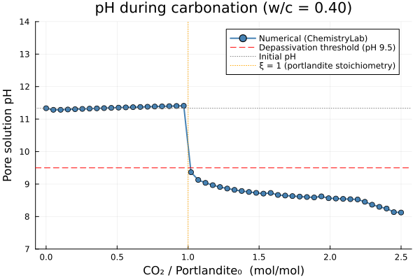
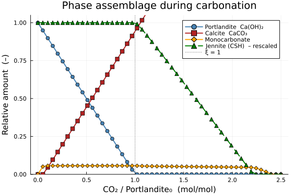

# [Carbonation of a Cement Paste](@id sec-cement-carbonation)

**Carbonation** is the principal durability threat to reinforced concrete.
Atmospheric CO₂ diffuses into the concrete cover, dissolves into the pore water, and reacts
with the alkaline hydration products — above all portlandite Ca(OH)₂ and calcium silicate
hydrates (CSH) — to precipitate calcium carbonate (calcite):

$$\ce{Ca(OH)2 + CO2 -> CaCO3 + H2O}$$

This consumption of alkalinity drives the pore-solution pH from ≈ 12.5–13 down to ≈ 8–9,
below the passivation threshold of the steel reinforcement (~9.5).
The depth at which pH drops below this threshold is the **carbonation front**.

This example simulates the progressive carbonation of a reference hydrated cement paste
by scanning the CO₂ intake from zero to 2.5× the stoichiometric portlandite capacity.
It tracks the pH of the pore solution, the depletion of portlandite and CSH, and the
accumulation of calcite.

---

## System setup

The **CEMDATA18-merged** database is used here because it contains both the cement
hydration products and the carbonate mineral phases (calcite `Cal`, monocarbonate,
hemicarbonate) within a single consistent dataset.

```@setup carbonation_setup
using ChemistryLab
using DynamicQuantities

substances = build_species("../../../data/cemdata18-merged.json")
```

The species list covers the full mineralogy of a hydrating and carbonating Portland cement
paste: clinker phases, classic hydration products, and the three principal carbonation
products.

| Group | Symbols | Role |
|-------|---------|------|
| Clinker | `C3S C2S C3A C4AF Gp` | Initial anhydrous phases |
| Hydration products | `Portlandite Jennite ettringite monosulphate12 C3AH6` | Formed during hydration |
| Carbonation products | `Cal monocarbonate hemicarbonate` | Formed on CO₂ uptake |
| CO₂ input | `CO2@` | Dissolved CO₂ entering the pore solution |

```@example carbonation_setup
input_species = split("""C3S C2S C3A C4AF Gp
                         Portlandite Jennite ettringite monosulphate12 C3AH6
                         Cal monocarbonate hemicarbonate
                         CO2@""")

species = speciation(
    substances, input_species;
    aggregate_state   = [AS_AQUEOUS],
    exclude_species   = split("H2@ O2@ H2S@ HS- thaumasite Arg"),
    include_species   = input_species,
)

cs = ChemicalSystem(species, CEMDATA_PRIMARIES)
```

!!! note "Why `cemdata18-merged`?"
    The standard `cemdata18-thermofun.json` does not contain calcite as a standalone
    mineral phase.  The merged database combines Cemdata18 with additional mineral
    solubility data, making `Cal` available with a consistent thermodynamic dataset.

---

## Building the equilibrium solver

A single solver is compiled once and reused for all calculations.

```@example carbonation_setup
using Optimization, OptimizationIpopt

opt = IpoptOptimizer(
    acceptable_tol        = 1e-10,
    dual_inf_tol          = 1e-10,
    acceptable_iter       = 100,
    constr_viol_tol       = 1e-10,
    warm_start_init_point = "no",
)

solver = EquilibriumSolver(
    cs,
    DiluteSolutionModel(),
    opt;
    variable_space = Val(:linear),
    abstol  = 1e-8,
    reltol  = 1e-8,
)

sp_idx = Dict(symbol(s) => i for (i, s) in enumerate(cs.species))
```

---

## Step 1 — Reference hydrated paste (no CO₂)

Before scanning the carbonation, the reference state of the fully hydrated paste is
established by solving the equilibrium without any CO₂ input.
This gives the initial portlandite inventory, which is used to normalise the CO₂ axis.

```@example carbonation_setup
compo = ["C3S" => 0.678, "C2S" => 0.166, "C3A" => 0.040, "C4AF" => 0.072, "Gp" => 0.028]
c     = sum(last.(compo))   # ≈ 0.984
wc    = 0.40
w     = wc * c
mtot  = c + w

state0 = ChemicalState(cs)
for (sym, mfrac) in compo
    set_quantity!(state0, sym, mfrac / mtot * u"kg")
end
set_quantity!(state0, "H2O@", w / mtot * u"kg")

V0 = volume(state0)
set_quantity!(state0, "H+",  1e-7u"mol/L" * V0.liquid)
set_quantity!(state0, "OH-", 1e-7u"mol/L" * V0.liquid)

ref = solve(solver, state0)

n_port0 = ustrip(ref.n[sp_idx["Portlandite"]])
n_ett0  = ustrip(ref.n[sp_idx["ettringite"]])
n_jen0  = ustrip(ref.n[sp_idx["Jennite"]])

println("Reference state (w/c = 0.40, no CO₂):")
println("  pH          = ", round(pH(ref),         digits = 2))
println("  Portlandite = ", round(n_port0,          digits = 3), " mol/kg")
println("  Ettringite  = ", round(n_ett0,           digits = 3), " mol/kg")
println("  Jennite     = ", round(n_jen0,           digits = 3), " mol/kg")
println("  Porosity    = ", round(porosity(ref)*100), " %")
```

---

## Step 2 — Progressive CO₂ uptake

For each CO₂ level, the clinker phases and water are set as in the reference state and
an additional amount of `CO2@` is added.
The solver finds the equilibrium that minimises the total Gibbs free energy,
distributing CO₂ between the dissolved carbonate species, calcite and the AFm carbonate
phases while consuming portlandite and, at higher dosages, CSH.

The CO₂ axis is normalised by `n_port0` so that **ξ = n(CO₂)/n(Portlandite)₀**.
Full carbonation of portlandite alone corresponds to ξ = 1.

```julia
ξ_range = range(0, 2.5; length = 50)   # dimensionless CO₂ / portlandite ratio

pH_vals      = Float64[]
n_Port_vals  = Float64[]
n_Cal_vals   = Float64[]
n_Monoc_vals = Float64[]
n_Jen_vals   = Float64[]

state = ChemicalState(cs)

for ξ in ξ_range
    n_CO2 = ξ * n_port0   # mol of CO₂ added per kg total paste

    for (sym, mfrac) in compo
        set_quantity!(state, sym, mfrac / mtot * u"kg")
    end
    set_quantity!(state, "H2O@",  w / mtot   * u"kg")
    set_quantity!(state, "CO2@",  n_CO2      * u"mol")

    V = volume(state)
    set_quantity!(state, "H+",  1e-7u"mol/L" * V.liquid)
    set_quantity!(state, "OH-", 1e-7u"mol/L" * V.liquid)

    state_eq = solve(solver, state)

    push!(pH_vals,      pH(state_eq))
    push!(n_Port_vals,  ustrip(state_eq.n[sp_idx["Portlandite"]]))
    push!(n_Cal_vals,   ustrip(state_eq.n[sp_idx["Cal"]]))
    push!(n_Monoc_vals, ustrip(state_eq.n[sp_idx["monocarbonate"]]))
    push!(n_Jen_vals,   ustrip(state_eq.n[sp_idx["Jennite"]]))
end
```

---

## Results

### pH of the pore solution

```julia
using Plots

p1 = plot(
    collect(ξ_range), pH_vals;
    xlabel     = "CO₂ / Portlandite₀  (mol/mol)",
    ylabel     = "Pore solution pH",
    label      = "Numerical (ChemistryLab)",
    linewidth  = 2,
    marker     = :circle,
    markersize = 4,
    color      = :steelblue,
    title      = "pH during carbonation (w/c = 0.40)",
    ylims      = (7, 14),
    legend     = :topright,
)
hline!(p1, [9.5];  linestyle = :dash, color = :red,
       label = "Depassivation threshold (pH 9.5)")
hline!(p1, [pH(ref)]; linestyle = :dot, color = :grey,
       label = "Initial pH")
vline!(p1, [1.0];  linestyle = :dot, color = :orange,
       label = "ξ = 1 (portlandite stoichiometry)")
p1
```



### Phase evolution

```julia
p2 = plot(
    collect(ξ_range), n_Port_vals ./ n_port0;
    xlabel     = "CO₂ / Portlandite₀  (mol/mol)",
    ylabel     = "Relative amount  (–)",
    label      = "Portlandite  Ca(OH)₂",
    linewidth  = 2,
    marker     = :circle,
    markersize = 4,
    color      = :steelblue,
    title      = "Phase assemblage during carbonation",
    ylims      = (0, 1.05),
    legend     = :topright,
)
plot!(p2, collect(ξ_range), n_Cal_vals   ./ n_port0;
    label     = "Calcite  CaCO₃",
    linewidth = 2, marker = :square, markersize = 4, color = :firebrick,
)
plot!(p2, collect(ξ_range), n_Monoc_vals ./ n_port0;
    label     = "Monocarbonate",
    linewidth = 2, marker = :diamond, markersize = 4, color = :orange,
)
plot!(p2, collect(ξ_range), n_Jen_vals   ./ n_jen0;
    label     = "Jennite (CSH)  – rescaled",
    linewidth = 2, marker = :utriangle, markersize = 4, color = :green,
    linestyle = :dash,
)
vline!(p2, [1.0]; linestyle = :dot, color = :grey, label = "ξ = 1")
p2
```



---

## Analysis

The simulation reveals four successive zones as CO₂ uptake increases:

| Zone | ξ range | Dominant reaction | pH |
|------|---------|------------------|----|
| **I** — AFm conversion | 0 → ~0.2 | monosulphate + CO₂ → monocarbonate + gypsum | ≈ 12.5 |
| **II** — Portlandite buffering | ~0.2 → 1 | Portlandite + CO₂ → calcite + H₂O | ≈ 12.0–12.5 |
| **III** — Portlandite depletion | ξ ≈ 1 | Portlandite exhausted; pH drops sharply | 12 → 9.5 |
| **IV** — CSH decalcification | 1 → 2.5 | Jennite (CSH) + CO₂ → calcite + amorphous SiO₂·xH₂O | 9–10 |

Key observations:

- **Zone I**: CO₂ first attacks the monosulphate and ettringite, converting them to
  monocarbonate.  pH remains nearly constant because portlandite acts as a reservoir.
- **Zone II**: Once the AFm phases are saturated, portlandite is consumed 1:1 by CO₂ to
  form calcite.  The high solubility of portlandite maintains pH ≈ 12–12.5.
- **Zone III**: The depletion of portlandite at ξ ≈ 1 triggers a sharp pH drop, crossing
  the steel passivation threshold (9.5).  This is the thermodynamic equivalent of the
  **carbonation front** passing through the concrete cover.
- **Zone IV**: Above ξ = 1, CSH (Jennite) is decalcified; pH stabilises around 9–10
  before eventually reaching the CO₂/HCO₃⁻ equilibrium (~8.3).

!!! tip "From equilibrium to service life"
    ChemistryLab provides the thermodynamic driving forces at each CO₂ exposure level.
    To translate this into a carbonation depth as a function of time, couple the phase
    diagram above with a diffusion model: the front advances when the local CO₂
    concentration exceeds the buffering capacity per unit volume of paste, which is
    directly read from the ξ-axis at the portlandite depletion point.

!!! note "Link to the carbonate system"
    The aqueous speciation within the carbonating pore solution — distribution between
    CO₂(aq), HCO₃⁻ and CO₃²⁻ — follows the same equilibria described in the
    [CO₂ dissolution example](@ref sec-co2-carbonate).
    In the high-pH pore solution (pH > 12), CO₃²⁻ dominates; below pH 8.3, CO₂(aq) takes over.
