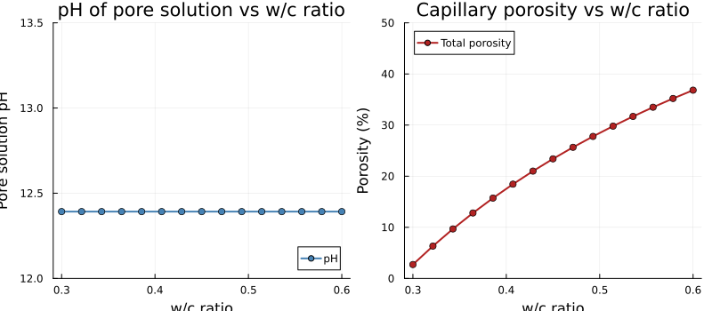
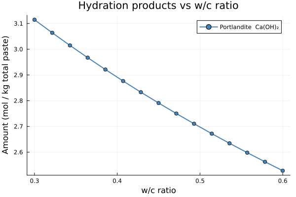

# [Effect of Water/Cement Ratio on Cement Hydration](@id sec-wc-ratio)

The **water-to-cement ratio** (w/c) is the single most important mix-design parameter
of concrete. It controls workability, compressive strength, and durability simultaneously.
From a thermodynamic perspective, it determines how much water is available to hydrate the
clinker phases, which in turn governs the nature and amount of hydration products, the
capillary porosity of the paste, and the pH of the pore solution.

This example scans w/c from 0.25 to 0.60 and tracks, at full thermodynamic equilibrium:

- the **pH** of the pore solution,
- the amounts of **portlandite** Ca(OH)₂ and **ettringite** formed,
- the **porosity** of the hardened paste.

---

## System setup

The species set and system are the same as in the
[simplified clinker dissolution](@ref sec-clinker-dissolution) example.

```@example wc_setup
using ChemistryLab
using DynamicQuantities

substances = build_species("../../../data/cemdata18-thermofun.json")

input_species = split("C3S C2S C3A C4AF Gp Anh Portlandite Jennite H2O@ ettringite monosulphate12 C3AH6 C3FH6 C4FH13")
species = speciation(substances, input_species; aggregate_state = [AS_AQUEOUS])

cs = ChemicalSystem(species, CEMDATA_PRIMARIES)
```

The clinker composition (mass fractions of the anhydrous cement phases) is fixed throughout the scan:

| Phase | Symbol | Mass fraction |
|-------|--------|---------------|
| Alite | `C3S`  | 67.8 % |
| Belite | `C2S` | 16.6 % |
| Aluminate | `C3A` | 4.0 % |
| Ferrite | `C4AF` | 7.2 % |
| Gypsum | `Gp`  | 2.8 % |

```@example wc_setup
compo = ["C3S" => 0.678, "C2S" => 0.166, "C3A" => 0.040, "C4AF" => 0.072, "Gp" => 0.028]
c     = sum(last.(compo))   # cement mass fraction (= 0.984 here)
```

---

## Building the equilibrium solver

A single [`EquilibriumSolver`](@ref) is compiled once and reused for every w/c point:

```@example wc_setup
using OptimizationIpopt

opt = IpoptOptimizer(
    acceptable_tol        = 1e-10,
    dual_inf_tol          = 1e-10,
    acceptable_iter       = 100,
    constr_viol_tol       = 1e-10,
    warm_start_init_point = "no",
)

solver = EquilibriumSolver(
    cs,
    DiluteSolutionModel(),
    opt;
    variable_space = Val(:linear),
    abstol  = 1e-8,
    reltol  = 1e-8,
)
```

---

## Scanning the w/c ratio

For each value of w/c, the initial composition is set from scratch and the equilibrium is
computed.  The total mass is normalised to 1 kg (cement + water) so that all amounts are
directly comparable across the scan.

```julia
sp_idx = Dict(symbol(s) => i for (i, s) in enumerate(cs.species))

wc_range = range(0.3, 0.60; length = 15)

pH_vals          = Float64[]
porosity_vals    = Float64[]
n_portlandite    = Float64[]
n_ettringite     = Float64[]
n_C3S_remaining  = Float64[]

state = ChemicalState(cs)

for wc in wc_range
    w    = wc * c
    mtot = c + w

    for (sym, mfrac) in compo
        set_quantity!(state, sym, mfrac / mtot * u"kg")
    end
    set_quantity!(state, "H2O@", w / mtot * u"kg")

    V = volume(state)
    set_quantity!(state, "H+",  1e-7u"mol/L" * V.liquid)
    set_quantity!(state, "OH-", 1e-7u"mol/L" * V.liquid)

    state_eq = solve(solver, state)

    push!(pH_vals,         pH(state_eq))
    push!(porosity_vals,   porosity(state_eq))
    push!(n_portlandite,   ustrip(state_eq.n[sp_idx["Portlandite"]]))
    push!(n_ettringite,    ustrip(state_eq.n[sp_idx["ettringite"]]))
    push!(n_C3S_remaining, ustrip(state_eq.n[sp_idx["C3S"]]))
end
```

---

## Results

### pH and porosity

```julia
using Plots

p1 = plot(
    collect(wc_range), pH_vals;
    xlabel    = "w/c ratio",
    ylabel    = "Pore solution pH",
    label     = "pH",
    linewidth = 2,
    marker    = :circle,
    markersize = 4,
    color     = :steelblue,
    title     = "pH of pore solution vs w/c ratio",
    ylims     = (12, 13.5),
    legend    = :bottomright,
)

p2 = plot(
    collect(wc_range), porosity_vals .* 100;
    xlabel    = "w/c ratio",
    ylabel    = "Porosity (%)",
    label     = "Total porosity",
    linewidth = 2,
    marker    = :circle,
    markersize = 4,
    color     = :firebrick,
    title     = "Capillary porosity vs w/c ratio",
    ylims     = (0, 50),
    legend    = :topleft,
)

plot(p1, p2; layout = (1, 2), size = (800, 350))
```



### Phase assemblage

```julia
p3 = plot(
    collect(wc_range), n_portlandite;
    xlabel    = "w/c ratio",
    ylabel    = "Amount (mol / kg total paste)",
    label     = "Portlandite  Ca(OH)₂",
    linewidth = 2,
    marker    = :circle,
    markersize = 4,
    color     = :steelblue,
    title     = "Hydration products vs w/c ratio",
    legend    = :topright,
)
p3
```



---

## Analysis

| w/c zone | Limiting factor | Key observations |
|----------|-----------------|-----------------|
| < 0.35 | **Water** | Incomplete hydration; unreacted C₃S persists; low porosity |
| ≈ 0.40–0.42 | Balanced | Complete hydration just achievable; minimum porosity |
| > 0.45 | **Clinker** | All clinker dissolves; excess water becomes capillary porosity |
| > 0.55 | — | High porosity; strength and durability decrease significantly |

Key findings:

- **pH** is buffered by portlandite (pKₛ Ca(OH)₂ ≈ 5.2) and remains relatively constant
  around 12.5–12.9 across the entire range, increasing slightly with w/c as more portlandite
  forms and the pore volume grows.
- **Portlandite** increases monotonically with w/c.  At low w/c it is water-limited;
  once enough water is available (w/c ≳ 0.42), the cement fully hydrates and portlandite
  reaches a plateau determined by the clinker C₃S + C₂S content.
- **Ettringite** is controlled by the aluminate (C₃A) and sulfate (Gp) contents, which are
  fixed in this scan, so its amount is nearly independent of w/c once hydration is complete.
- **Porosity** grows roughly linearly once all the clinker has reacted: the excess water that
  cannot fill hydration-product volume becomes capillary porosity.
- **Unreacted C₃S** disappears above the critical w/c threshold (≈ 0.40–0.42 for this
  composition), marking the transition from the water-limited to the clinker-limited regime.

!!! tip "Powers hydration model"
    The inflection observed around w/c ≈ 0.40–0.42 corresponds qualitatively to the
    critical ratio predicted by Powers' model:
    $w/c_{\text{crit}} = 0.36 \, \alpha_{\max}$, where $\alpha_{\max}$ is the maximum
    degree of hydration.  ChemistryLab computes the same threshold from first thermodynamic
    principles, without any empirical fitting parameter.

!!! note "Extending the scan"
    To study the effect of **supplementary cementitious materials** (SCMs) such as slag or
    fly ash, replace or partially substitute the clinker composition and add the corresponding
    species from the `cemdata18` database (e.g. `slag`, `C2ASH8`).
    To include **carbonation** effects, add `CO2@`, `HCO3-`, `CO3-2` and carbonate mineral
    phases from the merged database.
