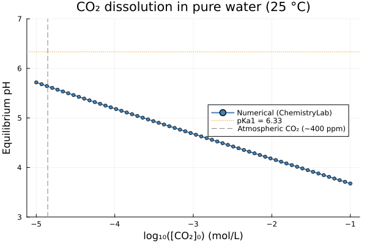
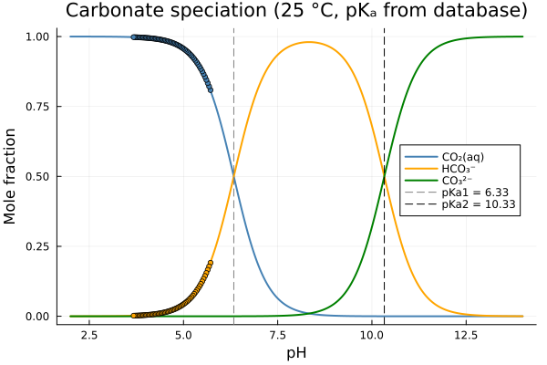

# [CO₂ Dissolution and the Carbonate System](@id sec-co2-carbonate)

The **carbonate system** — CO₂(aq) / HCO₃⁻ / CO₃²⁻ — is one of the most important
chemical equilibria in natural water chemistry, geochemistry, and environmental science.
It controls the pH of rainwater, rivers, oceans, and aquifers, and governs the dissolution
and precipitation of carbonate minerals such as calcite and dolomite.

This example shows how to:
1. Load species from a thermodynamic database and build a `ChemicalSystem`.
2. Extract dissociation constants (pKₐ₁, pKₐ₂) directly from standard Gibbs energies.
3. Simulate CO₂ dissolution in pure water over several orders of magnitude.
4. Construct the analytical speciation diagram (fraction of each carbonate species vs pH).

---

## System setup

All species are loaded from the **SLOP98 inorganic** database.
The system contains only H, O, C and charge-bearing species; no other elements are needed.

| Symbol    | Species             | Phase           |
|-----------|---------------------|-----------------|
| `H2O@`    | H₂O — water         | aqueous solvent |
| `H+`      | H⁺ — proton         | aqueous solute  |
| `OH-`     | OH⁻ — hydroxide     | aqueous solute  |
| `CO2@`    | CO₂(aq) — dissolved CO₂  | aqueous solute  |
| `HCO3-`   | HCO₃⁻ — bicarbonate | aqueous solute  |
| `CO3-2`   | CO₃²⁻ — carbonate   | aqueous solute  |

The three primary species `H2O@`, `H+`, `CO3-2` form a basis for the whole system:
every other aqueous species is a linear combination of these three.

```@example carbonate_setup
using Optimization, OptimizationIpopt
using ChemistryLab
using DynamicQuantities

substances = build_species("../../../data/slop98-inorganic-thermofun.json")

# Select only the six carbonate-system species
dict = Dict(symbol(s) => s for s in substances)
species = [dict[sym] for sym in split("H2O@ H+ OH- CO2@ HCO3- CO3-2")]

cs = ChemicalSystem(species, ["H2O@", "H+", "CO3-2"])
```

!!! note "Larger carbonate systems"
    If calcium is relevant (e.g. hard water, calcite dissolution), add `Ca+2` and its
    complexes to the species list and extend the primaries to `["H2O@", "H+", "CO3-2", "Ca+2"]`.
    The SLOP98 inorganic database also contains `Ca(HCO3)+` and `Ca(CO3)@`.

---

## Dissociation constants from thermodynamic data

The two acid–base equilibria of the carbonate system are:

$$\text{CO}_2(\text{aq}) + \text{H}_2\text{O} \rightleftharpoons \text{H}^+ + \text{HCO}_3^- \qquad \text{pK}_{a1} \approx 6.35$$

$$\text{HCO}_3^- \rightleftharpoons \text{H}^+ + \text{CO}_3^{2-} \qquad \text{pK}_{a2} \approx 10.33$$

Both constants are computed from standard Gibbs energies of formation at 25 °C,
exactly as in the acetic acid titration example:

```@example carbonate_setup
R  = ustrip(Constants.R)
T  = 298.15   # K
RT = R * T

sp = Dict(symbol(s) => s for s in cs.species)

# pKa1 : CO₂(aq) + H2O ⇌  HCO₃⁻ + H⁺
Ka1  = exp(-(sp["HCO3-"].ΔₐG⁰(T = T) + sp["H+"].ΔₐG⁰(T = T) - sp["H2O@"].ΔₐG⁰(T = T) - sp["CO2@"].ΔₐG⁰(T = T)) / RT)
pKa1 = -log10(Ka1)

# pKa2 : HCO₃⁻ ⇌ H⁺ + CO₃²⁻
Ka2  = exp(-(sp["CO3-2"].ΔₐG⁰(T = T) + sp["H+"].ΔₐG⁰(T = T) - sp["HCO3-"].ΔₐG⁰(T = T)) / RT)
pKa2 = -log10(Ka2)

# pKw : H₂O ⇌ H⁺ + OH⁻
Kw   = exp(-(sp["H+"].ΔₐG⁰(T = T) + sp["OH-"].ΔₐG⁰(T = T) - sp["H2O@"].ΔₐG⁰(T = T)) / RT)
pKw  = -log10(Kw)

println("pKa1 (CO₂(aq) / HCO₃⁻) = ", round(pKa1, digits = 2), "   (lit. 6.35)")
println("pKa2 (HCO₃⁻  / CO₃²⁻)  = ", round(pKa2, digits = 2), "   (lit. 10.33)")
println("pKw  (H₂O    / H⁺+OH⁻) = ", round(pKw,  digits = 2), "   (lit. 14.00)")
```

---

## Building the equilibrium solver

A single [`EquilibriumSolver`](@ref) is compiled once and reused for every point of the scan:

```@example carbonate_setup
using Optimization, OptimizationIpopt

solver = EquilibriumSolver(
    cs,
    DiluteSolutionModel(),
    IpoptOptimizer(
        acceptable_tol        = 1e-10,
        dual_inf_tol          = 1e-10,
        acceptable_iter       = 1000,
        constr_viol_tol       = 1e-10,
        warm_start_init_point = "no",
    );
    variable_space = Val(:linear),
    abstol  = 1e-8,
    reltol  = 1e-8,
)
```

---

## CO₂ dissolution scan

The experiment: 1 kg of pure water receives an increasing amount of dissolved CO₂ (CO₂(aq)),
from trace atmospheric levels (~10⁻⁵ mol) up to a highly carbonated solution (~0.1 mol).
Three representative concentrations illustrate the pH trend:

```@example carbonate_setup
s = ChemicalState(cs)
for (n_CO2, label) in [
    (1e-5, "atmospheric, ~400 ppm"),
    (1e-3, "lightly carbonated"),
    (1e-1, "strongly carbonated"),
]
    set_quantity!(s, "H2O@", 1.0u"kg")
    set_quantity!(s, "CO2@", n_CO2 * u"mol")
    V_liq = volume(s).liquid
    set_quantity!(s, "H+",  1e-7u"mol/L" * V_liq)
    set_quantity!(s, "OH-", 1e-7u"mol/L" * V_liq)
    s_eq = solve(solver, s)
    println("pH at [CO₂]₀ = ", n_CO2, " mol (", label, ") : ",
            round(pH(s_eq), digits = 2))
end
```

For the full scan used to generate the plots below, loop over 60 log-spaced points:

```julia
sp_idx = Dict(symbol(s) => i for (i, s) in enumerate(cs.species))

n_CO2_range = exp.(range(log(1e-5), log(0.1); length = 60))   # mol, in 1 kg H₂O

pH_vals     = Float64[]
f_CO2_vals  = Float64[]
f_HCO3_vals = Float64[]
f_CO3_vals  = Float64[]

s = ChemicalState(cs)
for n_CO2 in n_CO2_range
    set_quantity!(s, "H2O@",  1.0u"kg")
    set_quantity!(s, "CO2@",  n_CO2 * u"mol")

    V_liq = volume(s).liquid
    set_quantity!(s, "H+",  1e-7u"mol/L" * V_liq)   # pH-neutral seed
    set_quantity!(s, "OH-", 1e-7u"mol/L" * V_liq)

    s_eq = solve(solver, s)
    push!(pH_vals, pH(s_eq))

    n_a = ustrip(s_eq.n[sp_idx["CO2@"]])
    n_b = ustrip(s_eq.n[sp_idx["HCO3-"]])
    n_c = ustrip(s_eq.n[sp_idx["CO3-2"]])
    n_C = n_a + n_b + n_c

    push!(f_CO2_vals,  n_a / n_C)
    push!(f_HCO3_vals, n_b / n_C)
    push!(f_CO3_vals,  n_c / n_C)
end
```

---

## Result: pH as a function of dissolved CO₂

```julia
using Plots

p1 = plot(
    log10.(n_CO2_range), pH_vals;
    xlabel    = "log₁₀([CO₂]₀) (mol/L)",
    ylabel    = "Equilibrium pH",
    label     = "Numerical (ChemistryLab)",
    linewidth = 2,
    marker    = :circle,
    markersize = 3,
    color     = :steelblue,
    title     = "CO₂ dissolution in pure water (25 °C)",
    ylims     = (3, 7),
    legend    = :right,
)
hline!(p1, [pKa1]; linestyle = :dot, color = :orange, label = "pKa1 = $(round(pKa1, digits=2))")
vline!(p1, [log10(1.4e-5)]; linestyle = :dash, color = :grey,
       label = "Atmospheric CO₂ (~400 ppm)")
p1
```



---

## Speciation diagram

The distribution of carbonate species as a function of pH follows from the two pKₐ values.
Using the computed constants, the analytical mole fractions are:

$$\alpha_0(\text{CO}_2) = \frac{[\text{H}^+]^2}{[\text{H}^+]^2 + K_{a1}[\text{H}^+] + K_{a1}K_{a2}}$$

$$\alpha_1(\text{HCO}_3^-) = \frac{K_{a1}[\text{H}^+]}{[\text{H}^+]^2 + K_{a1}[\text{H}^+] + K_{a1}K_{a2}}$$

$$\alpha_2(\text{CO}_3^{2-}) = \frac{K_{a1}K_{a2}}{[\text{H}^+]^2 + K_{a1}[\text{H}^+] + K_{a1}K_{a2}}$$

```julia
Ka1_val = 10^(-pKa1)
Ka2_val = 10^(-pKa2)

function carbonate_fractions(ph)
    H     = 10^(-ph)
    denom = H^2 + Ka1_val * H + Ka1_val * Ka2_val
    return H^2 / denom, Ka1_val * H / denom, Ka1_val * Ka2_val / denom
end

pH_axis = range(2, 14; length = 1000)
fracs   = carbonate_fractions.(pH_axis)
f0 = [f[1] for f in fracs]
f1 = [f[2] for f in fracs]
f2 = [f[3] for f in fracs]

p2 = plot(
    collect(pH_axis), [f0 f1 f2];
    xlabel    = "pH",
    ylabel    = "Mole fraction",
    label     = ["CO₂(aq)" "HCO₃⁻" "CO₃²⁻"],
    linewidth = 2,
    color     = [:steelblue :orange :green],
    title     = "Carbonate speciation (25 °C, pKₐ from database)",
    legend    = :right,
)
vline!(p2, [pKa1]; linestyle = :dash, color = :grey,   label = "pKa1 = $(round(pKa1, digits=2))")
vline!(p2, [pKa2]; linestyle = :dash, color = :black,  label = "pKa2 = $(round(pKa2, digits=2))")

# Overlay the numerical points from the CO₂ scan
scatter!(p2, pH_vals, f_CO2_vals;  color = :steelblue, markersize = 3, label = "")
scatter!(p2, pH_vals, f_HCO3_vals; color = :orange,    markersize = 3, label = "")
p2
```



---

## Analysis

| Zone | pH range | Dominant species |
|------|----------|-----------------|
| Acidic / high CO₂ | pH < 6.35 (pKₐ₁) | CO₂(aq) |
| Buffer zone 1 | pH ≈ pKₐ₁ = 6.35 | CO₂(aq) / HCO₃⁻ (equal amounts) |
| Mid-range | 6.35 < pH < 10.33 | HCO₃⁻ |
| Buffer zone 2 | pH ≈ pKₐ₂ = 10.33 | HCO₃⁻ / CO₃²⁻ (equal amounts) |
| Alkaline | pH > 10.33 | CO₃²⁻ |

- **Atmospheric CO₂** (~10⁻⁵ mol/L) produces a pH of ≈ 5.6 in pure water — slightly acidic
  rain even without any pollutants.
- **Carbonated water** (industrial, ~0.05 mol/L CO₂) reaches pH ≈ 4.0–4.3.
- Because dissolved CO₂ always pushes the system into the CO₂(aq)-dominated zone (pH < pKₐ₁),
  the HCO₃⁻ and CO₃²⁻ domains are only accessible by **adding a base** (e.g. NaOH, CaCO₃
  dissolution) — which is the essence of ocean buffering and concrete alkalinity.

!!! note "Link to cement chemistry"
    In the pore solution of hydrated cement (pH ≈ 12.5–13), the dominant carbonate species
    is CO₃²⁻. When atmospheric CO₂ penetrates the concrete cover, the carbonate system
    shifts leftward until portlandite (Ca(OH)₂) is consumed and the pH drops below 9.
    This process — **carbonation** — is the main cause of corrosion initiation in reinforced
    concrete, and is explored in the [cement carbonation example](@ref sec-cement-carbonation).
