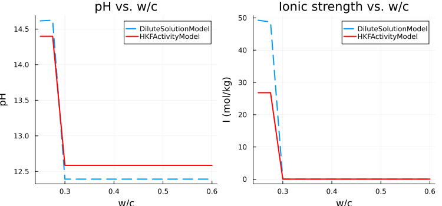

# [Activity Model Comparison: HKF vs. Ideal Dilute — Clinker Dissolution](@id sec-hkf-vs-dilute)

Cement pore solution is a concentrated electrolyte: at early hydration the ionic
strength of the pore solution typically reaches **I ≈ 0.2–0.5 mol/kg** due to
dissolved Ca²⁺, OH⁻, SO₄²⁻, and alkali ions.  At these concentrations the ideal
dilute assumption (γᵢ = 1) breaks down and non-ideal activity corrections become
significant.

This example runs the same clinker dissolution calculation twice — once with
[`DiluteSolutionModel`](@ref) and once with [`HKFActivityModel`](@ref) — and
compares the results.

---

## Why ionic strength matters in cement chemistry

The mean activity coefficient of Ca²⁺ predicted by the HKF model at various ionic
strengths gives a sense of the correction magnitude (25 °C, 1 bar):

| I (mol/kg) | γ(Ca²⁺) | γ(OH⁻) | γ(SO₄²⁻) |
|:----------:|:-------:|:------:|:--------:|
| 0.01       | 0.67    | 0.90   | 0.67     |
| 0.10       | 0.35    | 0.76   | 0.35     |
| 0.30       | 0.19    | 0.61   | 0.20     |
| 0.50       | 0.14    | 0.55   | 0.15     |

These coefficients enter the solubility products of portlandite, ettringite, and
C-S-H, so the equilibrium composition and pH both shift when non-ideality is
accounted for.

---

## System setup

```@setup hkf_setup
using ChemistryLab
using DynamicQuantities
using Printf

substances = build_species("../../../data/cemdata18-thermofun.json")
input_species = split("C3S C2S C3A C4AF Gp Anh Portlandite Jennite H2O@ ettringite monosulphate12 C3AH6 C3FH6 C4FH13")
species = speciation(substances, input_species; aggregate_state = [AS_AQUEOUS])
cs = ChemicalSystem(species, CEMDATA_PRIMARIES)
```

The species set and system are the same as in the
[simplified clinker dissolution](@ref sec-clinker-dissolution) example.

```julia
using ChemistryLab
using DynamicQuantities
using Printf

substances  = build_species("data/cemdata18-thermofun.json")
input_species = split("C3S C2S C3A C4AF Gp Anh Portlandite Jennite H2O@ " *
                      "ettringite monosulphate12 C3AH6 C3FH6 C4FH13")
species = speciation(substances, input_species; aggregate_state = [AS_AQUEOUS])
cs      = ChemicalSystem(species, CEMDATA_PRIMARIES)
```

---

## Building one solver per model

```@example hkf_setup
using OptimizationIpopt

opt = IpoptOptimizer(
    acceptable_tol        = 1e-10,
    dual_inf_tol          = 1e-10,
    acceptable_iter       = 100,
    constr_viol_tol       = 1e-10,
    warm_start_init_point = "no",
)

solver_dilute = EquilibriumSolver(
    cs, DiluteSolutionModel(), opt;
    variable_space = Val(:linear), abstol = 1e-8, reltol = 1e-8,
)

solver_hkf = EquilibriumSolver(
    cs, HKFActivityModel(), opt;
    variable_space = Val(:linear), abstol = 1e-8, reltol = 1e-8,
)
```

Both solvers share the same `ChemicalSystem` and Ipopt options; only the activity
model differs.

---

## Initial state (w/c = 0.40)

```@example hkf_setup
compo = ["C3S" => 0.678, "C2S" => 0.166, "C3A" => 0.040, "C4AF" => 0.072, "Gp" => 0.028]
c     = sum(last.(compo))
wc    = 0.40
w     = wc * c
mtot  = c + w

state = ChemicalState(cs)
for (sym, mfrac) in compo
    set_quantity!(state, sym, mfrac / mtot * u"kg")
end
set_quantity!(state, "H2O@", w / mtot * u"kg")

V = volume(state)
set_quantity!(state, "H+",  1e-7u"mol/L" * V.liquid)
set_quantity!(state, "OH-", 1e-7u"mol/L" * V.liquid)
```

---

## Running both equilibria

```@example hkf_setup
state_eq_dilute = solve(solver_dilute, state)
state_eq_hkf    = solve(solver_hkf,    state)
```

---

## Comparing key outputs

### pH and ionic strength

```@example hkf_setup
# Helper: ionic strength from equilibrium state
function ionic_strength(st)
    cs_eq = st.system
    i_w   = only(cs_eq.idx_solvent)
    M_w   = ustrip(u"kg/mol", cs_eq.species[i_w][:M])
    kgw   = ustrip(st.n[i_w]) * M_w
    I = 0.0
    for i in cs_eq.idx_solutes
        m = ustrip(st.n[i]) / kgw
        z = cs_eq.species[i].formula.charge
        I += 0.5 * m * z^2
    end
    return I
end

println("─────────────────────────────────────────────────────────")
println("                      Dilute       HKF")
println("─────────────────────────────────────────────────────────")
@printf "pH                    %6.3f      %6.3f\n"  pH(state_eq_dilute)  pH(state_eq_hkf)
@printf "I  (mol/kg)           %6.4f      %6.4f\n"  ionic_strength(state_eq_dilute)  ionic_strength(state_eq_hkf)
@printf "porosity              %6.4f      %6.4f\n"  ustrip(porosity(state_eq_dilute))  ustrip(porosity(state_eq_hkf))
println("─────────────────────────────────────────────────────────")
```

!!! note "Why pH is higher with HKF"
    The HKF model lowers the activity coefficient of OH⁻ (γ < 1).  To satisfy the
    solubility products (which depend on *activities*, not concentrations), the
    solver compensates by dissolving more portlandite, producing a higher OH⁻
    *molality* — and therefore a higher pH.

---

### Aqueous species concentrations

```@example hkf_setup
# Helper: molality from equilibrium state
function molality(st, sym)
    cs_eq = st.system
    i_w   = only(cs_eq.idx_solvent)
    M_w   = ustrip(u"kg/mol", cs_eq.species[i_w][:M])
    kgw   = ustrip(st.n[i_w]) * M_w
    i     = findfirst(s -> symbol(s) == sym, cs_eq.species)
    i === nothing && return NaN
    return ustrip(st.n[i]) / kgw   # mol/kg
end

ions = ["Ca+2", "OH-", "SO4-2", "AlO2-", "H+"]

println("─────────────────────────────────────────────────────────────")
println("  Species       Dilute (mmol/kg)    HKF (mmol/kg)    Δ (%)")
println("─────────────────────────────────────────────────────────────")
for sym in ions
    m_d = molality(state_eq_dilute, sym) * 1e3
    m_h = molality(state_eq_hkf,    sym) * 1e3
    Δ   = isnan(m_d) || m_d < 1e-12 ? NaN : (m_h - m_d) / m_d * 100
    @printf "  %-14s  %10.4f          %10.4f       %+6.1f\n"  sym  m_d  m_h  Δ
end
println("─────────────────────────────────────────────────────────────")
```

!!! note "Divalent ions are most affected"
    The Debye-Hückel correction scales as zᵢ², so Ca²⁺ and SO₄²⁻ (z = ±2) are
    affected much more than OH⁻ or Al(OH)₄⁻ (z = −1).

---

### Solid phase amounts

```@example hkf_setup
solids = ["Portlandite", "Jennite", "ettringite", "monosulphate12", "C3AH6"]

println("─────────────────────────────────────────────────────────────────")
println("  Phase            Dilute (mmol)    HKF (mmol)    Δ (%)")
println("─────────────────────────────────────────────────────────────────")
for sym in solids
    i_d = findfirst(s -> symbol(s) == sym, state_eq_dilute.system.species)
    i_h = findfirst(s -> symbol(s) == sym, state_eq_hkf.system.species)
    n_d = i_d === nothing ? NaN : ustrip(u"mmol", state_eq_dilute.n[i_d])
    n_h = i_h === nothing ? NaN : ustrip(u"mmol", state_eq_hkf.n[i_h])
    Δ   = isnan(n_d) || n_d < 1e-9 ? NaN : (n_h - n_d) / n_d * 100
    @printf "  %-18s  %9.3f          %9.3f      %+6.1f\n"  sym  n_d  n_h  Δ
end
println("─────────────────────────────────────────────────────────────────")
```

---

## Scanning w/c ratios with both models

The difference between models grows with ionic strength, which itself increases at
lower w/c (more dissolved species per unit water).

```julia
wc_range = range(0.25, 0.60; length = 15)

pH_dilute = Float64[]; pH_hkf = Float64[]
I_dilute  = Float64[]; I_hkf  = Float64[]

for wc in wc_range
    w    = wc * c;  mtot = c + w
    state = ChemicalState(cs)
    for (sym, mfrac) in compo
        set_quantity!(state, sym, mfrac / mtot * u"kg")
    end
    set_quantity!(state, "H2O@", w / mtot * u"kg")
    V = volume(state)
    set_quantity!(state, "H+",  1e-7u"mol/L" * V.liquid)
    set_quantity!(state, "OH-", 1e-7u"mol/L" * V.liquid)

    push!(pH_dilute, pH(solve(solver_dilute, state)))
    push!(pH_hkf,    pH(solve(solver_hkf,    state)))
    push!(I_dilute,  ionic_strength(solve(solver_dilute, state)))
    push!(I_hkf,     ionic_strength(solve(solver_hkf,    state)))
end
```

```julia
using Plots

p1 = plot(collect(wc_range), pH_dilute;
    label = "DiluteSolutionModel", lw = 2, ls = :dash,
    xlabel = "w/c", ylabel = "pH", title = "pH vs. w/c")
plot!(p1, collect(wc_range), pH_hkf;
    label = "HKFActivityModel", lw = 2, color = :red)

p2 = plot(collect(wc_range), I_dilute;
    label = "DiluteSolutionModel", lw = 2, ls = :dash,
    xlabel = "w/c", ylabel = "I (mol/kg)", title = "Ionic strength vs. w/c")
plot!(p2, collect(wc_range), I_hkf;
    label = "HKFActivityModel", lw = 2, color = :red)

plot(p1, p2; layout = (1, 2), size = (750, 350))
```



!!! tip "When to use HKF"
    The gap between the two models is largest at low w/c (high ionic strength).
    For cement paste at w/c ≤ 0.40, using `HKFActivityModel` is recommended.
    At w/c ≥ 0.60 and for dilute geochemical problems (seawater excepted),
    `DiluteSolutionModel` is a reasonable approximation.

---

## Summary

| Quantity | Dilute model | HKF model | Physical origin |
|:---------|:------------:|:---------:|:----------------|
| pH | lower | **higher** | Lower γ(OH⁻) → more dissolution |
| [Ca²⁺] | lower | **higher** | Lower γ(Ca²⁺) → more dissolution |
| [SO₄²⁻] | lower | **higher** | Lower γ(SO₄²⁻) → less ettringite |
| Portlandite | similar | **very slightly higher** | More Ca²⁺ in solution |
| Ettringite | similar | **similar** | No Ettringite |
| Porosity | similar | **similar** | Similar solid precipitation |

The key physical message is that **non-ideal activity corrections increase the
apparent solubility of all ionic phases**.  In the HKF model, lower activity
coefficients mean that a given amount of dissolved ion contributes *less* to
the chemical potential, so the system dissolves more solid to reach equilibrium.
