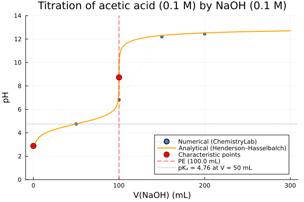

# [Titration of Acetic Acid by NaOH](@id sec-titration-acetic)

This example simulates the **potentiometric titration** of acetic acid (CH₃COOH, a monoprotic weak acid)
by sodium hydroxide (NaOH, a strong base), both at 0.1 M.
The dissociation constant pKₐ is computed directly from the thermodynamic database,
and the numerical titration curve is compared against the analytical Henderson–Hasselbalch approximation.

---

## System setup

Species are loaded from two SLOP98 databases:
the inorganic database provides H₂O, H⁺, OH⁻, NaOH and Na⁺;
the organic database provides acetic acid and acetate.

| Symbol   | Species                    | Phase           |
|----------|----------------------------|-----------------|
| `AceH@`  | CH₃COOH — acetic acid      | aqueous solute  |
| `Ace-`   | CH₃COO⁻ — acetate          | aqueous solute  |
| `NaOH@`  | NaOH — sodium hydroxide    | aqueous solute  |
| `Na+`    | Na⁺                        | aqueous solute  |
| `H+`     | H⁺                         | aqueous solute  |
| `OH-`    | OH⁻                        | aqueous solute  |
| `H2O@`   | H₂O                        | aqueous solvent |

The primaries `H2O@`, `H+`, `Ace-`, `Na+` form a basis for the system.
Every other species is expressed as a linear combination of these four.

```@setup titration_acetic_setup
using ChemistryLab
using DynamicQuantities

substances_inorg = build_species("../../../data/slop98-inorganic-thermofun.json")
substances_org   = build_species("../../../data/slop98-organic-thermofun.json")

dict_all_species = merge(
    Dict(symbol(s) => s for s in substances_inorg),
    Dict(symbol(s) => s for s in substances_org),
)
species = [dict_all_species[s] for s in split("H2O@ Na+ NaOH@ H+ OH- AceH@ Ace-")]

cs = ChemicalSystem(species, ["H2O@", "H+", "Ace-", "Na+"])
```

```julia
using ChemistryLab
using DynamicQuantities

substances_inorg = build_species("../../../data/slop98-inorganic-thermofun.json")
substances_org   = build_species("../../../data/slop98-organic-thermofun.json")

dict_all_species = merge(
    Dict(symbol(s) => s for s in substances_inorg),
    Dict(symbol(s) => s for s in substances_org),
)
species = [dict_all_species[s] for s in split("H2O@ Na+ NaOH@ H+ OH- AceH@ Ace-")]

cs = ChemicalSystem(species, ["H2O@", "H+", "Ace-", "Na+"])
# pprint(cs.SM) #  for pretty-printing the stoichiometric matrix
```

!!! note "Restricting the species set"
    This example uses a hand-picked list of species for efficiency.
    To include all compatible species from the databases automatically, use `speciation`:
    ```julia
    aq_species  = speciation(substances_inorg, split("H2O@ Na+ NaOH@ H+ OH-"); aggregate_state=[AS_AQUEOUS])
    ace_species = speciation(substances_org, split("AceH@ Ace-"); aggregate_state=[AS_AQUEOUS])
    species     = unique(s -> symbol(s), vcat(aq_species, ace_species))
    ```
    Note that equilibrium calculations may be more expensive, and that the results
    assume the system reaches thermodynamic equilibrium — kinetic effects are not captured.

---

## Dissociation constant from thermodynamic data

The pKₐ is derived from the standard Gibbs energies of the dissociation reaction
CH₃COOH ⇌ CH₃COO⁻ + H⁺:

```@example titration_acetic_setup
R  = Constants.R
T  = 25ua"degC" # equivalent to 298.15u"K"
RT = R * T

sp = Dict(symbol(s) => s for s in cs.species)

Ka  = exp(-(sp["Ace-"].ΔₐG⁰(T=T, unit=true) + sp["H+"].ΔₐG⁰(T=T, unit=true) - sp["AceH@"].ΔₐG⁰(T=T, unit=true)) / RT)
pKa = -log10(Ka)
println("Ka  = ", Ka)
println("pKa = ", round(pKa, digits = 2))
```

Build the [`EquilibriumSolver`](@ref) once — it is reused for each titration point:

```julia
using OptimizationIpopt

solver = EquilibriumSolver(
    cs,
    DiluteSolutionModel(),
    IpoptOptimizer(
        acceptable_tol        = 1e-10,
        dual_inf_tol          = 1e-10,
        acceptable_iter       = 1000,
        constr_viol_tol       = 1e-10,
        warm_start_init_point = "no",
    );
    variable_space = Val(:linear),
    abstol  = 1e-10,
    reltol  = 1e-10,
)
```

---

## Running the titration

The base is introduced as `NaOH@` (the undissociated form); the solver distributes it at equilibrium
between `NaOH@`, `Na+` and `OH-` according to the stoichiometric constraints.

```julia
ca  = 0.1      # acetic acid concentration, mol/L
Va  = 0.1      # volume of acid solution, L
cb  = 0.1      # NaOH concentration, mol/L
nAH = ca * Va  # total moles of CH₃COOH = 10 mmol

Vbeq = nAH / cb   # equivalence volume, L
V_eq = Vbeq * 1e3  # equivalence volume, mL

ρ_water = 1.   # kg/L

volumes_NaOH = range(0, 2 * V_eq; length = 100)   # mL
pH_vals = Float64[]

s = ChemicalState(cs)
for V_mL in volumes_NaOH
    Vb      = V_mL * 1e-3      # L
    n_NaOH  = cb * Vb           # mol of NaOH added
    V_total = Va + Vb           # total volume, L

    set_quantity!(s, "AceH@", nAH    * u"mol")
    set_quantity!(s, "NaOH@", n_NaOH * u"mol")
    set_quantity!(s, "H2O@",  ρ_water * V_total * u"kg")

    V_liq = volume(s).liquid
    set_quantity!(s, "H+",  1e-7u"mol/L" * V_liq)   # pH-neutral seed
    set_quantity!(s, "OH-", 1e-7u"mol/L" * V_liq)

    s_eq = solve(solver, s)
    push!(pH_vals, pH(s_eq))
end

idx_heq = argmin(abs.(collect(volumes_NaOH) .- V_eq / 2))
idx_eq  = argmin(abs.(collect(volumes_NaOH) .- V_eq))

println("pH at V =   0 mL  (pure acid)         : ", round(pH_vals[begin],   digits = 2))
println("pH at V =  50 mL  (½ PE, ≈ pKₐ)      : ", round(pH_vals[idx_heq], digits = 2))
println("pH at V = 100 mL  (equivalence point) : ", round(pH_vals[idx_eq],   digits = 2))
println("pH at V = 200 mL  (excess NaOH)       : ", round(pH_vals[end],      digits = 2))
```

---

## Titration curve

The numerical result is compared against the analytical approximation.
In the buffer zone (before the equivalence point), the Henderson–Hasselbalch equation applies;
beyond the equivalence point, the pH is controlled by the excess NaOH concentration.

```julia
using Plots

function ana_pH(Vb_mL)
    Vb = Vb_mL * 1e-3
    Vb ≈ 0 && return (-log10(ca) + pKa) / 2   # pure acid approximation
    return Vb < Vbeq ?
        pKa + log10(cb * Vb / (nAH - cb * Vb)) :
        14  + log10((cb * Vb - nAH) / (Va + Vb))
end

pH0  = (-log10(ca) + pKa) / 2
pHeq = (pKa + 14 + log10(ca * Va / (Va + Vbeq))) / 2

p = plot(
    collect(volumes_NaOH), pH_vals;
    xlabel     = "V(NaOH) (mL)",
    ylabel     = "pH",
    label      = "Numerical (ChemistryLab)",
    linewidth  = 0,
    marker     = :circle,
    markersize = 3,
    color      = :steelblue,
    title      = "Titration of acetic acid (0.1 M) by NaOH (0.1 M)",
    ylims      = (0, 14),
    legend     = :bottomright,
)
lVb = range(0.01 * V_eq, 3 * V_eq; length = 10_000)
plot!(p, lVb, ana_pH.(lVb);
    label     = "Analytical (Henderson–Hasselbalch)",
    linewidth = 2,
    color     = :orange,
)
scatter!(p, [0, V_eq], [pH0, pHeq];
    label      = "Characteristic points",
    color      = :red,
    markersize = 6,
)
vline!(p, [V_eq]; linestyle = :dash, color = :red,  label = "PE ($(round(V_eq, digits=1)) mL)")
hline!(p, [pKa];  linestyle = :dot,  color = :grey, label = "pKₐ = $(round(pKa, digits=2)) at V = 50 mL")
```


