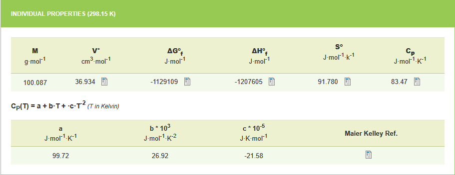
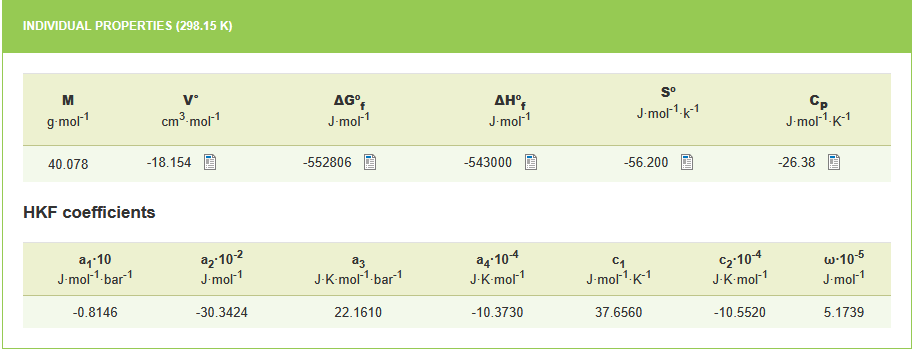
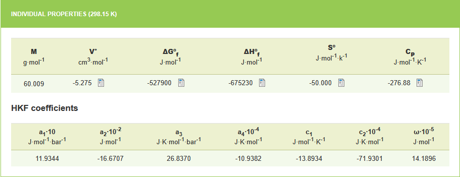

# Getting started

This quickstart shows a few common, minimal examples to get you productive with ChemistryLab. It demonstrates creating species, building reactions and generating a stoichiometric matrix.

## Simplified example

Let us start with a minimal example in which we compute the thermodynamic properties of a reaction. As a first illustration, we consider the equilibrium of calcite in water. This equilibrium can be written as:

$CaCO_3 \rightleftharpoons Ca^{2+} + {CO_3}^{2-}$

It is possible to calculate the thermodynamic properties of the reaction, in particular the equilibrium constant of the reaction ($\ln K$) which is related to the Gibbs free energy of the reaction ($\Delta_r G^°$). This calculation is performed at a reference temperature of 298 K using the following equation:

$\Delta_r G^° = RT\ln K$

where $\Delta_r G^°$ is deduced from the Gibbs energies of formation ($\Delta_f {G_i}^°$) of the other chemical species involved in the reaction:

$\Delta_r G^° = \sum_i \nu_i \Delta_f {G_i}^°$

### First step: species declaration

The first step, therefore, is to construct each of the species present in the reaction. This can be done with the [`Species`](@ref) function. Its simplest use is as follows:

```julia
using ChemistryLab

calcite = Species("CaCO3")
Ca²⁺ = Species("Ca2+")
CO₃²⁻ = Species("CO32-")
```

The created object contains a certain amount of information that can be entered *a posteriori* (or during the construction of the [`Species`](@ref)).

```@example example1
using ChemistryLab #hide

calcite = Species("CaCO3") #hide
Ca²⁺ = Species("Ca2+") #hide
CO₃²⁻ = Species("CO32-") #hide
CO₃²⁻
```

!!! note "Calculation of Molar Mass"
    It can be noted that during the construction of the species, a calculation of the molar mass is systematically performed.

### Second step: calculation of the thermodynamic properties of each species

For each species, it is possible to assign thermodynamic properties, such as the Gibbs energy of formation or the heat capacity. This data can be found in databases (e.g. [thermoddem database](https://thermoddem.brgm.fr)). For calcite, the properties are described in the following figure:


To enter data into ChemistrLab, several steps are required.

#### Thermodynamic properties of formation

The first involves associating the values ​​of the thermodynamic properties of formation for each species.

```julia
using DynamicQuantities

th_prop_0_calcite = [:Cp⁰ => 83.47u"J/K/mol", :ΔₐH⁰ => -1207605u"J/mol", :S⁰ => 91.78u"J/(mol*K)", :ΔₐG⁰ => -1129109u"J/mol", :V⁰ => 36.934u"J/bar"]

th_prop_0_Ca²⁺ = [:Cp⁰ => -26.38u"J/K/mol", :ΔₐH⁰ => -543000u"J/mol", :S⁰ => -56.2u"J/(mol*K)", :ΔₐG⁰ => -552806u"J/mol", :V⁰ => -18.154u"J/bar"]

th_prop_0_CO₃²⁻ = [:Cp⁰ => -276.88u"J/K/mol", :ΔₐH⁰ => -675230u"J/mol", :S⁰ => -50.00u"J/(mol*K)", :ΔₐG⁰ => -527900u"J/mol", :V⁰ => -5.275u"J/bar"]
```

!!! note "Unity"
    ChemistryLab uses the **DynamicQuantities** library to specify the units for each parameter or property to ensure the consistency of the expressions.

#### Heat capacity, enthalpy and free energy as a function of temperature

The second objective is to describe the evolution of heat capacity as a function of temperature for each species. For calcite, this can be done as follows:

```julia
cp_coeffs_calcite = [:a => 99.72u"J/K/mol", :b => 26.92e3u"J/mol/K^2", :c => -21.58e-5u"J*K/mol"]
Cp_expr_calcite = :(a + b * T + c / T^2)

calcite.properties = thermo_functions_generic_cp_ft(Cp_expr_calcite, cp_coeffs_calcite, th_prop_0_calcite; ref=[:T => 298.15u"K"])
```

!!! tip "Expression of Cp as a function of temperature"
    In the Thermoddem database, the expression for heat capacity as a function of temperature is written as:

    $C_p(T) = a + b * T + c * T^{-2}$

    The chosen option for populating this expression was to explicitly write the function $C_p(T)$ using the `thermo_functions_generic_cp_ft` function. However, the expression given in Thermoddem for this species is a simplification of the following more complete function:

    $C_p(T) = a + b * T + c * T^{-2} + d * T^{0.5} + e * T^2$

    Because this expression is implemented in ChemistryLab, another choice could therefore have been the following:
    ```julia
    dtf_calcite = thermo_functions_cp_ft_equation(cp_coeffs_calcite, th_prop_0_calcite; ref=[:T => 298.15u"K"])
    ```

Calling the `thermo_functions` (here `thermo_functions_generic_cp_ft`) allows the calculation of the expressions for the different thermodynamic properties as a function of temperature, according to the following expressions:

$\Delta_a {H^°}_T = \int_{T_{ref}}^T C_p(\tau) d\tau + \Delta_f {H^°}_{T_{ref}}$

$S^° = \int_{T_{ref}}^T \frac{C_p(\tau)}{\tau} d\tau + {S^°}_{T_{ref}}$

$\Delta_a {G^°}_T = \int_{T_{ref}}^T C_p(\tau) d\tau - T * \int_{T_{ref}}^T \frac{C_p(\tau)}{\tau} d\tau - (T - T_{ref}){S^°}_{T_{ref}} + \Delta_f G^°_{T_{ref}}$

where $\Delta_a {H^°}_T$ and $\Delta_a {G^°}_T$ are the apparent enthalpy and free energy (Gibbs) at T.

The expressions for the thermodynamic properties of calcite as a function of temperature appear as follows:

```@example example1

using ChemistryLab, DynamicQuantities #hide

th_prop_0_calcite = [:Cp⁰ => 83.47u"J/K/mol", :ΔₐH⁰ => -1207605u"J/mol", :S⁰ => 91.78u"J/(mol*K)", :ΔₐG⁰ => -1129109u"J/mol", :V⁰ => 36.934u"J/bar"] #hide

th_prop_0_Ca²⁺ = [:Cp⁰ => -26.38u"J/K/mol", :ΔₐH⁰ => -543000u"J/mol", :S⁰ => -56.2u"J/(mol*K)", :ΔₐG⁰ => -552806u"J/mol", :V⁰ => -18.154u"J/bar"] #hide

th_prop_0_CO₃²⁻ = [:Cp⁰ => -276.88u"J/K/mol", :ΔₐH⁰ => -675230u"J/mol", :S⁰ => -50.00u"J/(mol*K)", :ΔₐG⁰ => -527900u"J/mol", :V⁰ => -5.275u"J/bar"] #hide

cp_coeffs_calcite = [:a => 99.72u"J/K/mol", :b => 26.92e3u"J/mol/K^2", :c => -21.58e-5u"J*K/mol"] #hide
Cp_expr_calcite = :(a + b * T + c / T^2) #hide

dtf_calcite = thermo_functions_generic_cp_ft(Cp_expr_calcite, cp_coeffs_calcite, th_prop_0_calcite; ref=[:T => 298.15u"K"]) #hide

calcite.Cp⁰ = dtf_calcite[:Cp⁰]
calcite.ΔₐH⁰ = dtf_calcite[:ΔₐH⁰]
calcite.S⁰ = dtf_calcite[:S⁰]
calcite.ΔₐG⁰ = dtf_calcite[:ΔₐG⁰]
```

```@example example1
using Plots

lT = ((0:1:100) .+ 273.15).*u"K"
p1 = plot(xlabel="Temperature [°C]", ylabel="ΔₐH⁰ [J mol⁻¹]", title="Enthalpy of calcite as a function of temperature")
plot!(p1, ustrip.(lT), ustrip.(calcite.properties[:ΔₐH⁰].(lT)))

savefig("pcoplot.png"); nothing # hide
```


Similarly, we can provide information on the thermal capacity of species $Ca^{2+}$ and ${CO_3}^{-2}$, as proposed in the thermoddem database:






These new properties are also functions of temperature. However, unlike calcite, the heat capacities of $Ca^{2+}$ and ${CO_3}^{-2}$ as a function of temperature are expressed using the Helgeson-Kirkham-Flowers equation. This equation is not yet implemented in ChemistryLab (see note below). We therefore take the values ​​at 25°C given in Thermoddem, that is -26.38 and -276.88, respectively.


```@example example1
#Ca2+
cp_coeffs_Ca²⁺ = [:a₀ => -26.38u"J/K/mol"]
properties(Ca²⁺) = thermo_functions_cp_ft_equation(cp_coeffs_Ca²⁺, th_prop_0_Ca²⁺; ref=[:T => 298.15u"K"])

#CO32-
cp_coeffs_CO₃²⁻ = [:a₀ => -276.88u"J/K/mol"]
properties(CO₃²⁻) = thermo_functions_cp_ft_equation(cp_coeffs_CO₃²⁻, th_prop_0_CO₃²⁻; ref=[:T => 298.15u"K"])
```

!!! warning "Implementation of Helgeson-Kirkham-Flowers equation"
    Although the Helgeson-Kirkham-Flowers equation is not implemented, the expressions for enthalpies and free energies are temperature-dependent due to the integration performed on Cp. Furthermore, within the temperature and pressure ranges currently tested in ChemistryLab, assuming a constant temperature for Cp has little impact on the solubility product of a reaction.

### Third step: writing the reaction


<!-- 
1- On créé chacune des espèces
2- On associe à chacune des espèces la capacité thermique et l'énergie de Gibbs de formation sous forme de fonction de la température (on montre pour cela les copies d'écran de thermoddem)
3- On trace l'évolution de Cp de la calcite en fonction de la température
3- On créé la réaction à partir des species précédemment créées
5- On calcule la capacité thermique de réaction (en montrant, avant, la formule mathématique)
6- On montre la formule mathématique du calcul du logK
7- On calcule le logK et on l'intègre dans les param thermo de la réaction
8- On trace l'évolution du logK en fonction de la température.
 -->


## Notes and next steps

- The `Formula`, `Species`, `Reaction` and `StoichMatrix` APIs are intentionally small and composable — explore the `docs/src/` pages for detailed examples.
- For cement-specific workflows, use `CemSpecies` and the `databases` utilities to convert between oxide- and atom-based representations.

Now try the `quickstart` examples interactively in the REPL and then follow the next pages of the tutorial for deeper coverage.
